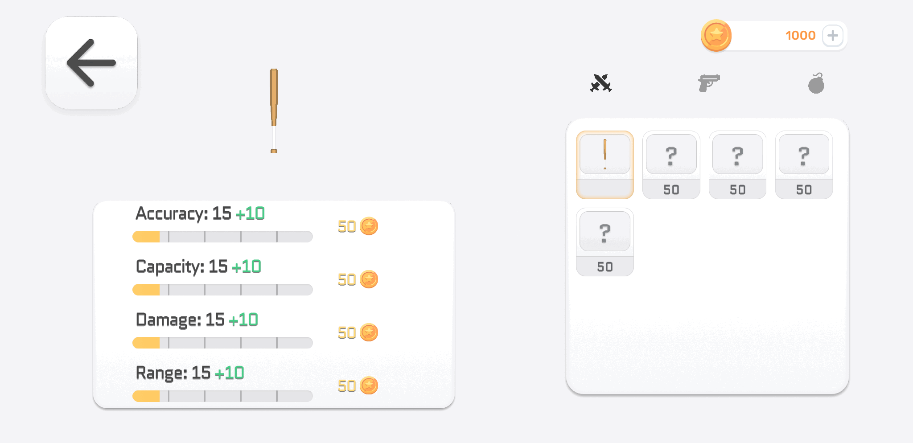

# 🛒 Upgradable Market System (Unity)

## Overview

This project showcases the core building blocks of an **upgradable market system** in a game.

Players can browse items, view their prices, purchase them using in-game currency, and upgrade owned items.  
The system is built using an **event-driven architecture** and clearly separates **data and runtime state**, while handling UI updates and save/load logic.

This repository is intended as a **system showcase**, not a full game.

---

## ✨ Features

- **ScriptableObject-based item database**
- **Runtime item state management**  
  (unlocked status, current level, owned amount, etc.)
- **Dynamic UI generation**  
  (market items are created automatically at runtime)
- **Purchase validation & feedback**
  - Insufficient funds → error SFX
  - Successful purchase → completion SFX
- **Event-driven architecture**
- **Player progression persistence** using JSON save/load

---

## 🛠 Technical Info

- **Unity Version:** 2022.3.x  
- **Platform:** Mobile  
- **Technologies Used:**  
  - Unity C#  
  - ScriptableObjects  
  - Event System  
  - JSON Save/Load  
  - Dynamic UI generation  

🎥 Demo videos are included to visually demonstrate the system behavior.

 
